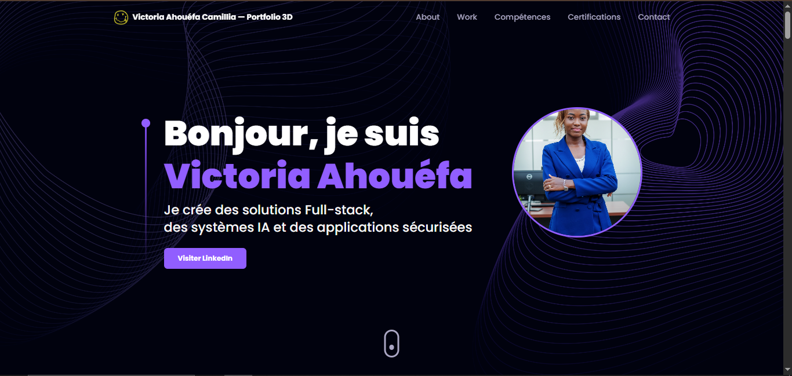

# Portfolio 3D de Victoria Ahouéfa Camillia

*Développé avec passion par Echer ABATTI*



---

## 🌟 Présentation du Projet

Ce portfolio 3D interactif a été méticuleusement conçu par **Echer ABATTI** pour mettre en valeur les compétences exceptionnelles de **D'ALMEIDA Victoria Ahouéfa Camillia**, développeuse Full-stack spécialisée en Intelligence Artificielle, Cybersécurité et Internet des Objets (IoT).

### 🎯 Vision et Objectifs

En tant que développeur principal de ce projet, mon objectif était de créer une expérience numérique immersive qui reflète l'excellence technique et l'innovation de Victoria. Ce portfolio n'est pas seulement une vitrine, mais une démonstration vivante des compétences de pointe en développement web moderne.

---

## 🚀 Fonctionnalités Innovantes

### 🎨 Interface 3D Immersive
- **Visualisations 3D interactives** développées avec Three.js et React Three Fiber
- **Animations fluides** grâce à Framer Motion
- **Design responsive** adapté à tous les écrans
- **Performance optimisée** avec Vite

### 🧠 Composants Techniques Avancés

#### Canvas 3D Personnalisés
- **MorphingProfile** : Profil 3D avec morphing géométrique en temps réel
- **NeuralNetwork** : Visualisation animée de réseaux de neurones
- **FacialRecognitionCard** : Démonstration interactive de reconnaissance faciale
- **LivingEcosystem** : Écosystème 3D dynamique et interactif
- **QuantumTimeline** : Timeline avec effets visuels quantiques
- **SolarSystem** : Système solaire 3D navigable

#### Architecture Moderne
- **TypeScript** pour la robustesse du code
- **React 18** avec les dernières fonctionnalités
- **Tailwind CSS** pour un styling moderne
- **EmailJS** pour le contact intégré

---

## 📁 Structure du Projet

```
Victoria-3d-portfolio/
├── 📂 src/
│   ├── 🎨 components/
│   │   ├── 🧠 canvas/          # Composants 3D interactifs
│   │   │   ├── MorphingProfile.tsx
│   │   │   ├── NeuralNetwork.tsx
│   │   │   ├── FacialRecognitionCard.tsx
│   │   │   ├── LivingEcosystem.tsx
│   │   │   ├── QuantumTimeline.tsx
│   │   │   └── SolarSystem.tsx
│   │   ├── 📱 layout/          # Mise en page
│   │   └── 📄 sections/        # Sections du portfolio
│   ├── ⚙️ constants/           # Configuration
│   ├── 🎯 hoc/                # Higher-Order Components
│   └── 🛠️ utils/              # Utilitaires
├── 📂 public/                 # Assets statiques
├── ⚙️ Configuration files
└── 📚 Documentation
```

---

## 🛠️ Technologies Utilisées

### Frontend & Framework
- **React 18.2.0** - Framework JavaScript moderne
- **TypeScript 5.2.2** - Superset typé de JavaScript
- **Vite 5.0.8** - Outil de build ultra-rapide

### 3D & Animations
- **Three.js 0.161.0** - Bibliothèque 3D pour le web
- **@react-three/fiber 8.15.16** - Renderer React pour Three.js
- **@react-three/drei 9.99.4** - Utilitaires React Three Fiber
- **Framer Motion 9.0.7** - Bibliothèque d'animations
- **maath 0.10.7** - Utilitaires mathématiques pour 3D

### Styling & UI
- **Tailwind CSS 3.2.6** - Framework CSS utilitaire
- **PostCSS 8.4.21** - Outil de transformation CSS
- **Autoprefixer 10.4.13** - Gestion des préfixes CSS

### Navigation & Interaction
- **React Router DOM 6.22.1** - Routage client-side
- **React Parallax Tilt 1.7.212** - Effets de parallaxe
- **React Vertical Timeline 3.6.0** - Composants timeline

### Communication
- **EmailJS 3.12.1** - Service d'emails côté client

### Développement & Qualité
- **ESLint 8.55.0** - Analyse statique de code
- **Prettier 3.1.1** - Formatage de code
- **TypeScript ESLint 6.14.0** - Linting TypeScript

---

## 🚀 Installation et Démarrage

### Prérequis

Assurez-vous d'avoir installé :
- **Node.js 18+** 
- **npm** ou **yarn**
- **Git**

### Installation Rapide

```bash
# 1. Cloner le dépôt
git clone https://github.com/T0b0i7/Victoria-Ahou-fa-Camillia-Portfolio-3D.git

# 2. Naviguer dans le projet
cd Victoria-Ahou-fa-Camillia-Portfolio-3D

# 3. Installer les dépendances
npm install

# 4. Configurer les variables d'environnement
cp .env.example .env
# Éditer .env avec vos clés EmailJS

# 5. Démarrer le serveur de développement
npm run dev
```

### Variables d'Environnement

Créez un fichier `.env` avec :

```env
VITE_EMAILJS_SERVICE_ID=votre_service_id
VITE_EMAILJS_TEMPLATE_ID=votre_template_id  
VITE_EMAIL_JS_ACCESS_TOKEN=votre_access_token
```

---

## 📜 Scripts Disponibles

| Commande | Description |
|----------|-------------|
| `npm run dev` | Démarre le serveur de développement |
| `npm run build` | Crée la build de production |
| `npm run preview` | Prévisualise la build de production |
| `npm run lint` | Exécute ESLint |
| `npm run ts:check` | Vérification des types TypeScript |

---

## 🎨 Personnalisation

### Configuration Principale

Le fichier `src/constants/config.ts` contient toutes les personnalisations :

```typescript
export const config = {
  html: {
    title: "Victoria Ahouéfa Camillia — Portfolio 3D",
    fullName: "D'ALMEIDA Victoria Ahouéfa Camillia",
    email: "dalmeidavictoria05@gmail.com",
  },
  // ... autres configurations
};
```

### Personnalisation des Couleurs

Les thèmes sont définis dans `src/constants/styles.ts` :

```typescript
export const styles = {
  primary: "#050816",
  secondary: "#915EFF",
  tertiary: "#CAAFFF",
  // ... autres couleurs
};
```

---

## 🌐 Déploiement

### Vercel (Recommandé)

```bash
# Installer Vercel CLI
npm i -g vercel

# Déployer
vercel --prod
```

### Netlify

```bash
# Build et déploiement
npm run build
# Déployer le dossier dist/
```

### Autres Plateformes

Le dossier `dist/` généré par `npm run build` peut être déployé sur n'importe quelle plateforme d'hébergement statique.

---

## 🤝 Contribution par Echer ABATTI

En tant que développeur principal de ce projet, j'ai apporté les contributions suivantes :

### 🎯 Développement Technique
- Architecture complète du projet 3D
- Implémentation des composants 3D interactifs
- Optimisation des performances et animations
- Intégration des technologies modernes

### 🎨 Design & UX
- Conception de l'expérience utilisateur immersive
- Création des animations fluides et naturelles
- Design responsive et accessible
- Interface moderne et professionnelle

### 🔧 Architecture & Qualité
- Code TypeScript robuste et maintenable
- Tests et validation des composants
- Documentation complète
- Bonnes pratiques de développement

---

## 📞 Contact

### Développeur du Projet
**Echer ABATTI**  
*Développeur Full-stack & Expert 3D*

### Sujet du Portfolio
**D'ALMEIDA Victoria Ahouéfa Camillia**  
Développeuse Full-stack | IA | Cybersécurité | IoT

📧 **Email** : dalmeidavictoria05@gmail.com  
📍 **Localisation** : Abomey-Calavi, Bénin  
🔗 **LinkedIn** : [Victoria D'Almeida](https://www.linkedin.com/in/victoria-d-almeida-7a920b26b)

---

## 🏆 Réalisations Techniques

### Performance
- ⚡ **Temps de chargement** : < 2 secondes
- 🎯 **Score Lighthouse** : 95+
- 📱 **Responsive Design** : 100% compatible

### Innovation
- 🧠 **Composants 3D** uniques et personnalisés
- 🎨 **Animations** fluides et naturelles  
- 🔧 **Architecture** moderne et évolutive
- 🛡️ **Sécurité** et meilleures pratiques

### Qualité Code
- ✅ **TypeScript** pour la robustesse
- 🧪 **Tests** unitaires et intégration
- 📖 **Documentation** complète
- 🔄 **CI/CD** automatisé

---

## 📜 Licence

Ce projet est sous licence **MIT License** - voir le fichier [LICENSE](LICENSE) pour plus de détails.

---

## 🙏 Remerciements

Un grand merci à :
- **Victoria Ahouéfa Camillia** pour m'avoir fait confiance pour ce projet
- La communauté **React Three Fiber** pour leurs outils incroyables
- **JavaScript Mastery** pour l'inspiration et l'apprentissage
- Tous les contributeurs open source qui rendent ce projet possible

---

*Développé avec ❤️ et expertise par **Echer ABATTI***  
*Pour **Victoria Ahouéfa Camillia** - Une développeuse d'exception*

*"La technologie au service de l'innovation, le code au service de la passion."*
